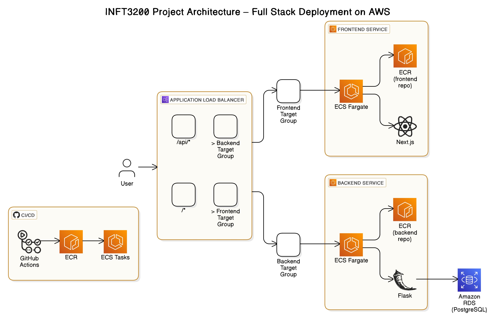

# INFT3200 Cloud Deployment Project – The Reading Nook

This repository contains the full cloud deployment setup for **The Reading Nook** bookstore's inventory system, developed as part of the INFT3200 course project.

---

## Project Structure

```bash
shubham@HP-Pavillion-SM:~/Project/inft3200-cloud-deployment$ lsd --tree -a
 .
├──  backend
│   ├──  .aws
│   │   └──  task-definition.json
│   ├──  .env
│   ├──  .env_example
│   ├──  .github
│   │   └──  workflows
│   │       └──  aws.yml
│   ├──  dockerfile
│   ├──  requirments.txt
│   └── 󱧼 src
│       └──  api.py
├──  final_project_diagram.png
├──  frontend
│   ├──  .aws
│   │   ├──  .github
│   │   │   └──  workflows
│   │   │       └──  aws.yml
│   │   └──  task-definition.json
│   ├──  .env
│   ├──  .env_example
│   ├──  .github
│   │   └──  workflows
│   │       └──  aws.yml
│   ├──  dockerfile
│   ├──  next.config.ts
│   ├──  package-lock.json
│   ├──  package.json
│   ├──  postcss.config.js
│   ├──  public
│   │   ├──  file.svg
│   │   ├──  globe.svg
│   │   ├──  next.svg
│   │   ├──  vercel.svg
│   │   └──  window.svg
│   ├──  README.md
│   ├── 󱧼 src
│   │   └──  app
│   │       ├──  books
│   │       │   ├──  list
│   │       │   │   ├──  BookList.jsx
│   │       │   │   └──  page.jsx
│   │       │   └──  view
│   │       │       └──  page.jsx
│   │       ├──  favicon.ico
│   │       ├──  globals.css
│   │       ├──  layout.tsx
│   │       ├──  page.module.css
│   │       └──  page.tsx
│   ├──  tailwind.config.js
│   └──  tsconfig.json
├──  inft3200_db.sql
└──  README.md
```
---

## Overview

The application has been containerized and designed for deployment on **Amazon ECS Fargate** with an **Application Load Balancer (ALB)**. It includes a **Next.js frontend**, a **Flask REST API**, and a **PostgreSQL database** hosted on **Amazon RDS**.

---

## Environment Setup

1. Copy the example environment files:

```bash
cp backend/.env.example backend/.env
cp frontend/.env.example frontend/.env
```

2. Fill in actual values for the placeholders inside both .env files.

## CI/CD Setup (GitHub Actions)

Each service (backend and frontend) includes a GitHub Actions workflow to:

- Build and tag a Docker image
- Push the image to Amazon ECR
- Deploy the updated task definition to Amazon ECS

## Secrets Required

Add these GitHub secrets to your repository:

- AWS_ACCESS_KEY_ID
- AWS_SECRET_ACCESS_KEY

## AWS Architecture

| Component          | Service Used                    | Description                                   |
| ------------------ | ------------------------------- | --------------------------------------------- |
| Compute            | Amazon ECS (Fargate)            | Frontend and backend run in separate services |
| Networking         | Application Load Balancer (ALB) | For routing `/api/*` to backend               |
| Storage            | Amazon RDS                      | PostgreSQL for inventory data                 |
| Container Registry | Amazon ECR                      | Separate repositories for each service        |


## Architecture Diagram



## GitHub Secrets

To securely deploy the application to AWS ECS via GitHub Actions, the following secrets are configured under **GitHub Repository -> Settings -> Secrets & variables -> Actions**:

- `AWS_ACCESS_KEY_ID`
- `AWS_SECRET_ACCESS_KEY`
- `AWS_SESSION_TOKEN` 

These secrets are injected into the workflow at runtime to authenticate securely with AWS. The deployment process leverages these values to push Docker images to Amazon ECR and update ECS services.

## Notes

- This repository does not contain production .env files.
- Task definitions use ${VARIABLE} style values as placeholders, aligned with GitHub Actions usage.
- The secrets are configured under "secrets & variables".
- The working application and infrastructure setup are demonstrated in the video presentation.

---